# **TASK 2: API**
## Overview
An Application Programming Interface (API) allows different software applications to communicate with each other. It enables developers to access data or services from external platforms without needing to know how the system works internally.

## Objective
1. Understood the concept of APIs.
2. Make API requests and retrieve data.
3. Built a simple user interface to display the API data.

## Working
I understood how API works. APIs follow a request response model and the user interacts with the application. The application then sends a request to the API. This task uses the OpenWeather API to fetch real time weather data such as temperature and weather conditions. The API processes the request and the server sends back the data. Finally, the application displays the information

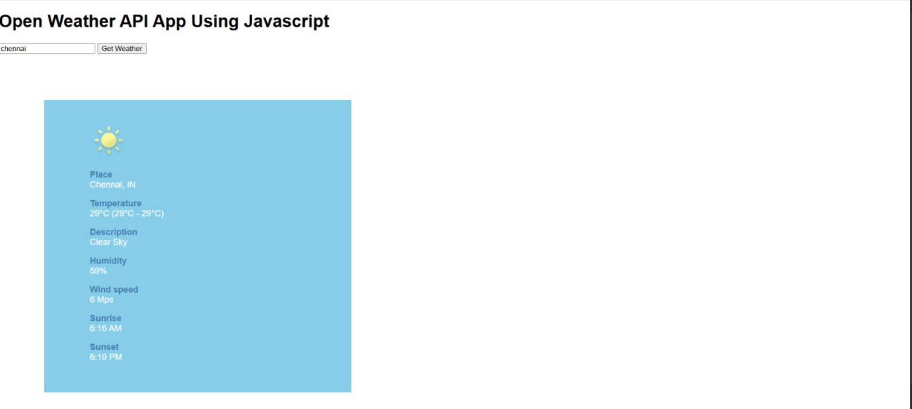

---

# **TASK 3: Working with Github**
## Overview
GitHub is a platform used for version control and collaboration. It allows developers to manage code, track changes, and work together on projects using Git. I explored GitHub features such as workflows, issues, and pull requests.

## Objective
1. Understood the basic features of GitHub
2. Learnt about GitHub workflows using GitHub actions
3. Worked with issues and pull requests in a repository

## Working
The given repository was explored to understand its structure and the instructions provided in the README file. I studied the GitHub actions to understand how automated workflows can be used to build, test, and deploy the code. I reviewed the issues to track tasks, bugs, or improvement as give in the task. A pull request was created to propose changes to the repository. This allowed the modifications to be reviewed before merging into the main branch.

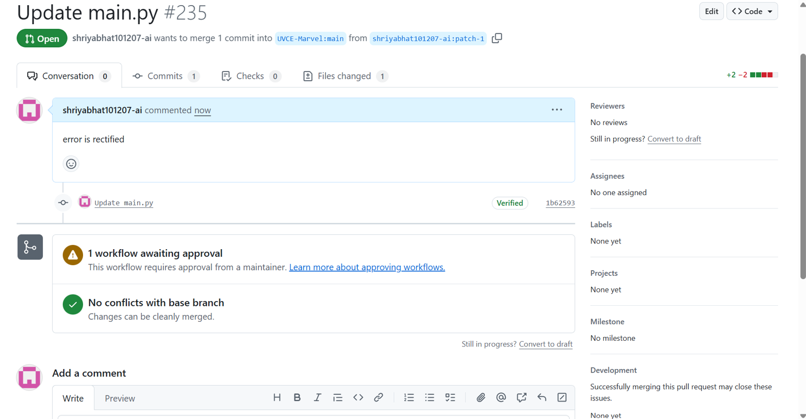
[githubrepo](https://github.com/UVCE-Marvel/git-task)

---

# **TASK 4: Get familiar with the command line on ubuntu**
## Overview
The command line interface in Ubuntu allowed me to interact with the system using text based commands. This task involved performing basic file and folder operations using terminal commands.

## Objective
1. Became familiar with the Ubuntu command line
2. Learnt basic file and directory management commands
3. Performed operations such as creating folders, files, and concatenating text files

## Working
First, I created a folder and navigated into it. Then, I created a blank file and listed the files in the folder. I created multiple folders and concatenated 2 text files. All required file and directory operations mentioned were successfully executed using the terminal commands.

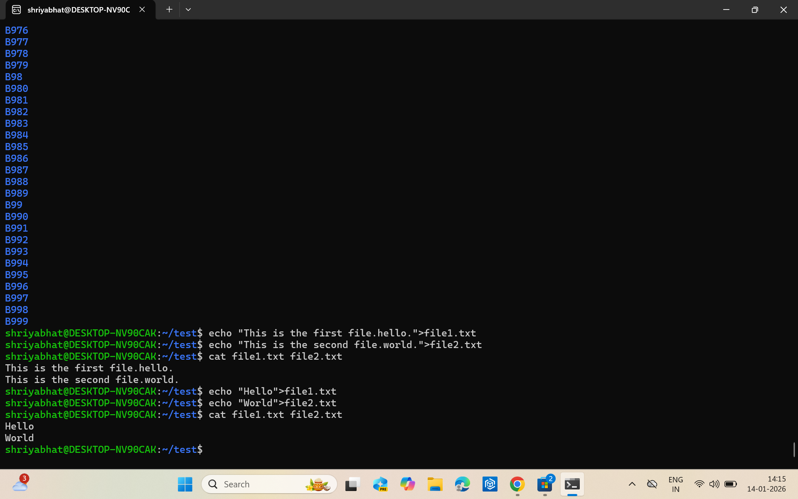

---

# **TASK 5: Build Your Own Brain -Linear Regression from Scratch**

## Overview
This task focuses on implementing linear regression from scratch using Python and comparing its performance with the information provided by scikit-learn. The model was trained and evaluated using the California housing dataset.

## Objective
1. I understood how gradient descent optimizes model parameters.
2. I compared the custom implementation with `sklearn.linear_model.LinearRegression`.
3. I was able to evaluate model performance using standard regression metrics.

## Working
I prepared the data and loaded the california housing dataset. I used "feature scaling" to normalize the data. Then I started linear regression from scratch which included initializing the weights and bias. I Updated the weights repeatedly to reduce the error in predictions. I also used "gradient descent" to minimize the error. The same dataset was trained using the built in linear regression model from scikit-learn for comparison. The performance metrics which I used are:

1. Mean Squared Error (MSE)– Measures average squared prediction error, i.e it shows how much the predicted values differ from the actual values on average. Bigger errors mean that the results are affected more.
2. Mean Absolute Error (MAE)– Measures average absolute difference between predicted and actual values, i.e it shows the average difference between the predicted values and the actual values.
3. R² Score– This indicates how well the model explains the variance in the data, i.e it shows how well the model predicts the data. If the value is closer to 1, it means better predictions.


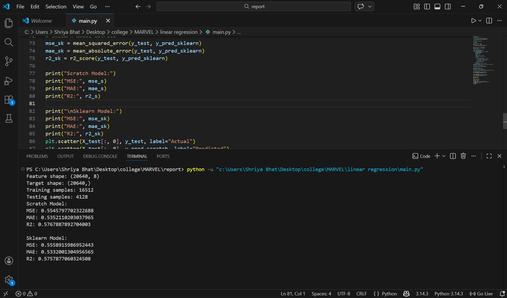
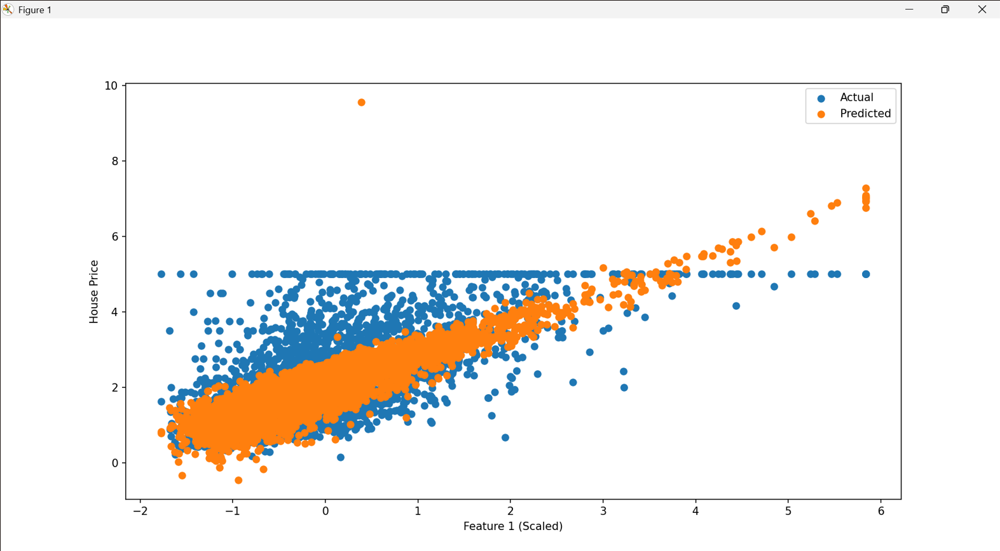

---

# **TASK 6: The Matrix Puzzle — Decode with NumPy & Reveal the Image**

## Overview
This task involved solving a visual puzzle using NumPy and Matplotlib. A scrambled matrix was provided, and the goal of the task was to manipulate the matrix using NumPy operations to reveal a hidden image. The decoded matrix was then visualized using Matplotlib.

## Objective
1. I learnt how to work with NumPy and understood how array and matrix operations work 
2. I had a lot of fun in manipulating and reshaping the scrambled matrix  
3. I visualized the decoded matrix as an image using Matplotlib 

## Working 

First I loaded the data. I downloaded the scrambled matrix file and loaded it into Python using NumPy. I was able to perform several NumPy operations to decode the matrix like reshaping the array into a square matrix and transposing it to the correct orientation or flipping rows or columns if required. These steps helped me arrange the data in the correct structure. After decoding, I displayed the matrix 
```python
plt.imshow(decoded_matrix)
plt.show()
```
This revealed the hidden image

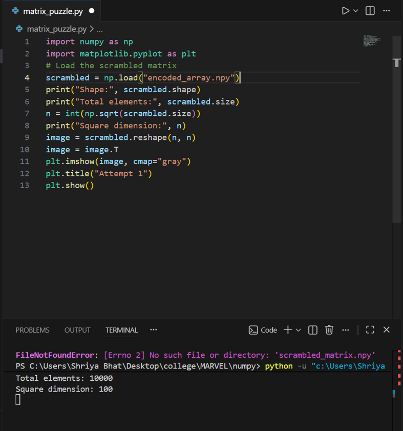
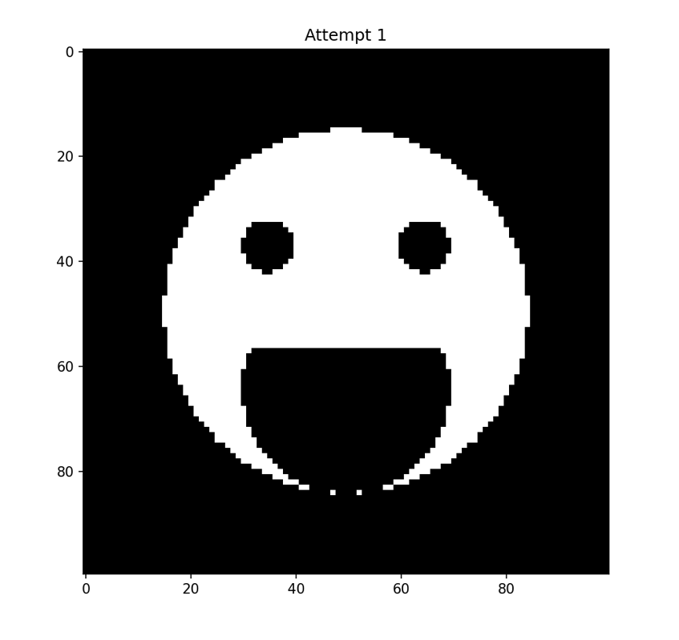

---

# **TASK 7: Create a Portfolio Webpage**

## Overview
This task involved creating a personal portfolio website to showcase my skills, projects, interests, and social media profiles. I designed the website to be responsive and visually appealing using HTML and CSS.

## Objective
1. Built a responsive personal portfolio webpage  
2. Included sections such as about me, projects, interests, and social links  
3. Hosted the website by pushing it to my git repository

## Working
I started by creating a HTML layout with separate sections like About Me, Projects, Interests, and Social Links. I used CSS to style the webpage and ensured it is responsive across different devices. Then, I initialized a Git repository and pushed all files to GitHub for hosting and tracking changes.  

[My Portfolio](https://github.com/shriyabhat101207-ai/portfolio)

---

# **TASK 8: Writing Resource Article using Markdown**

## Overview
This task involved creating a technical resource article using Markdown, a lightweight markup language that allows formatting of plain text with headings, lists, links, etc. Markdown ensures consistent display across devices and platforms without relying on complex text editors. The article was written on a technical topic of "How CAPTCHA'S work" and submitted to the MARVEL website as required.

## Objective
1. Learnt to write and format technical articles using Markdown.  
2. Explored Markdown features like headings, bullet points, URLs, images, etc.  
3. Prepared an article in a professional, readable format and pushed it to my GitHub repo.

[Resource Article](https://github.com/shriyabhat101207-ai/resource-article/blob/master/resourceArticle.md)

---


# **TASK 9: Tinkercad**

## Overview
This task involved exploring TINKERCAD, an online electronics simulation platform and building a simple radar system using an ultrasonic sensor and a servo motor. The system detects objects within a specified range by measuring the time taken for sound waves to bounce back, and the results are displayed on the LCD screen.

## Objective
1. Created and explored my Tinkercad account  
2. Understood how an ultrasonic sensor measures distance  
3. Learnt the working of a servo motor  
4. Simulated a simple radar system to detect obstacles

## Working 
First, I created a Tinkercad account and explored it. I also went through some simple circuits and understood the basic working of the components. Then created a simulation. I started by connecting ultrasonic sensor with the arduino and programmed it to calculate distance using time of flight principle. Then displayed the distances on serial monitor. Added a servo motor to rotate the ultrasonic sensor and collected distance measurements at different angles to simulate a radar detection system.

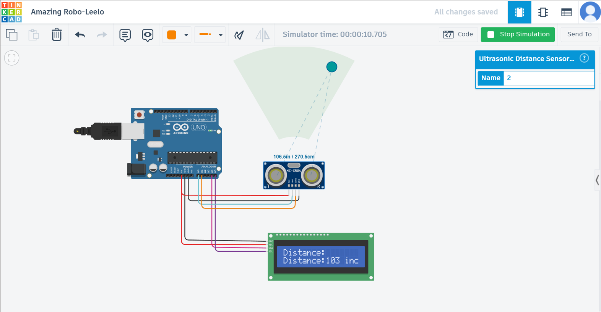

---

# **TASK 11: LED Toggle Using ESP32**

## Overview
Through this task I learnt the basics of the ESP32 microcontroller and created a simple web server to control an LED connected to the ESP32 GPIO pins. The program was written and uploaded using the Arduino IDE.

## Objective
1. Understaood the working of ESP32  
2. Created a web server on ESP32  
3. Controlled the LED via the web interface  
4. Learnt to configure Arduino IDE for ESP32  

## Working
First, I connected an LED to a GPIO pin on the ESP32.Then I Configured the arduino IDE for ESP32 board support. Wrote the code to create a web server that can toggle the LED ON/OFF and uploaded it on the ESP32. Then we can access the web server via a browser to control the LED.  

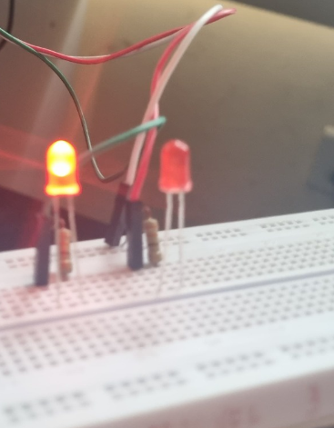

---

# **TASK 12: Soldering Prerequisites**

## Overview
This task involved learning the basics of soldering and familiarizing with the equipment like soldering iron, solder wick, flux, solder wire, perf board in the lab. 

## Objective
1. Understood the function of solder, flux, and other tools  
2. Performed basic soldering on a simple circuit  
3. Documented the soldering process under supervision 

## Working

First, I observed and leart the proper handling of soldering tools from the co-ordinator. Then I prepared a simple LED circuit on a perf board and applied flux to the joints and used the soldering iron to solder connections. Then used solder wick to remove any excess solder and ensured all solder joints were properly connected.

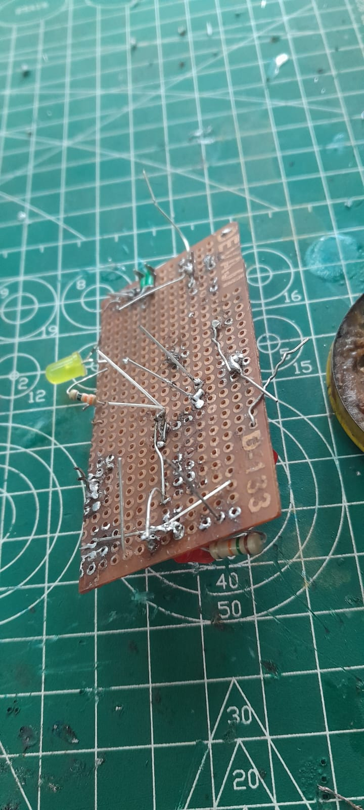
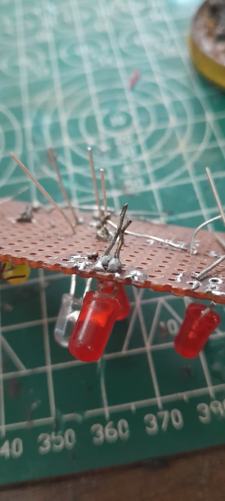

---

# **TASK 14: Karnaugh Maps and Deriving the logic circuit**

## Overview
This task involved using karnaugh maps to design a burglar alarm. The alarm is triggered based on state of door and key.

## Objective
1. Learnt to use K-maps to simplify boolean expressions.
2. Designed a logic circuit using boolean logic gates

# Working
So, there can be 4 possible cases and we can create a K-map from each case and simplify the logic. Then I designed the circuit using AND, OR & NOT gates to indicate alarm conditions. 

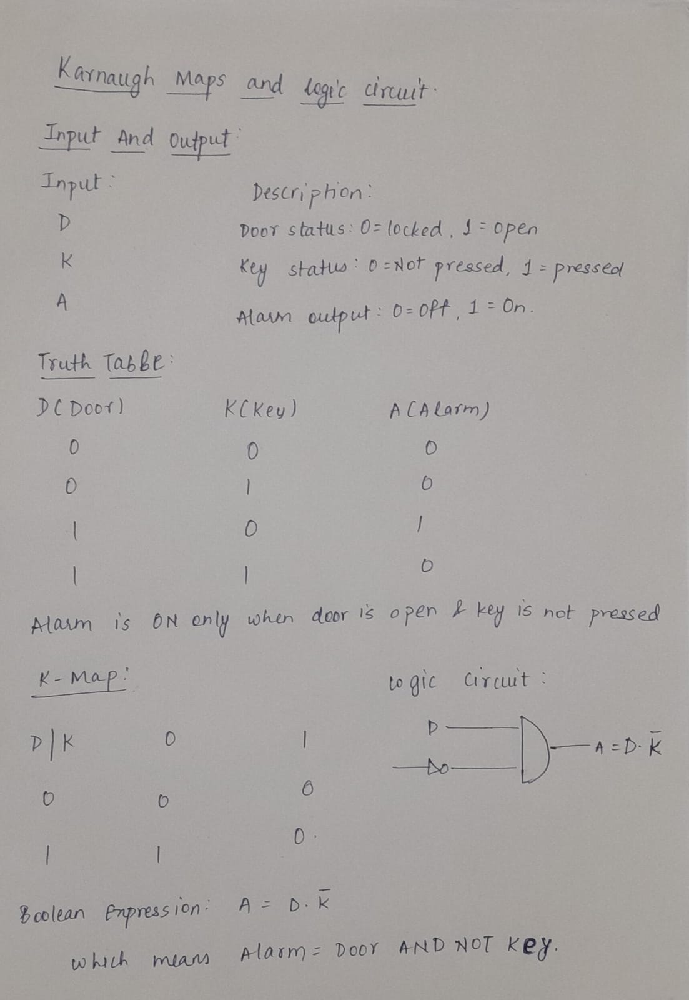

---


# **TASK 15: Active Participation**

I recently took part in a hackathon "Codestorm" in the inter-college technical fest "IMPETUS" conducted by IEEE UVCE. We were given 4 problem statements and 3 hours to complete the problem statements. This improved my time management, problem solving skills and technical learning. It was a good opportunity to collaborate and brainstorm.

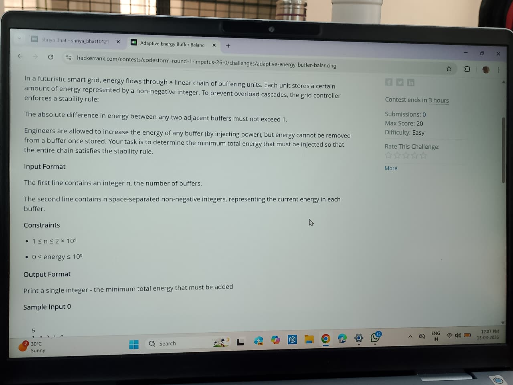
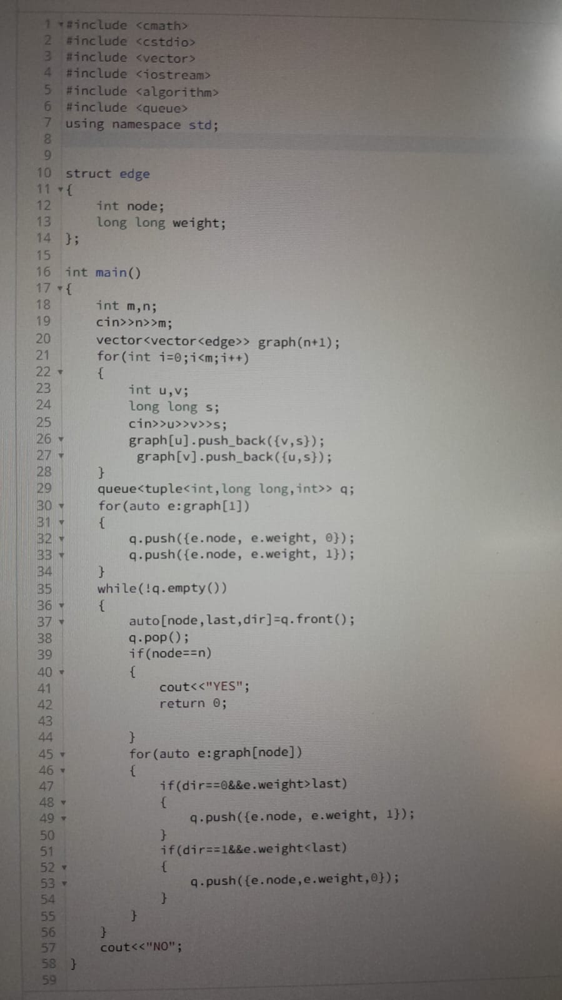

---

# **TASK 18: Sad servers - "Like LeetCode for Linux"**

## Overview
This task involved solving Linux challenges on the sadservers website. The goal was to identify and fix issues in a fixed time and it helped improving problem solving and command line skills.

## Objective
1. Identified errors and fixed issues  
2. Gained hands-on experience with common linux commands

## Working
First, I Accessed the Sadservers platform and analyzed the problem by reading the description and system logs. I was given 8 hints to crack the problem and I was able to apply linux commands to investigate and fix the issues. Finally, I verified the solution by checking system responses and made the sad server happy.

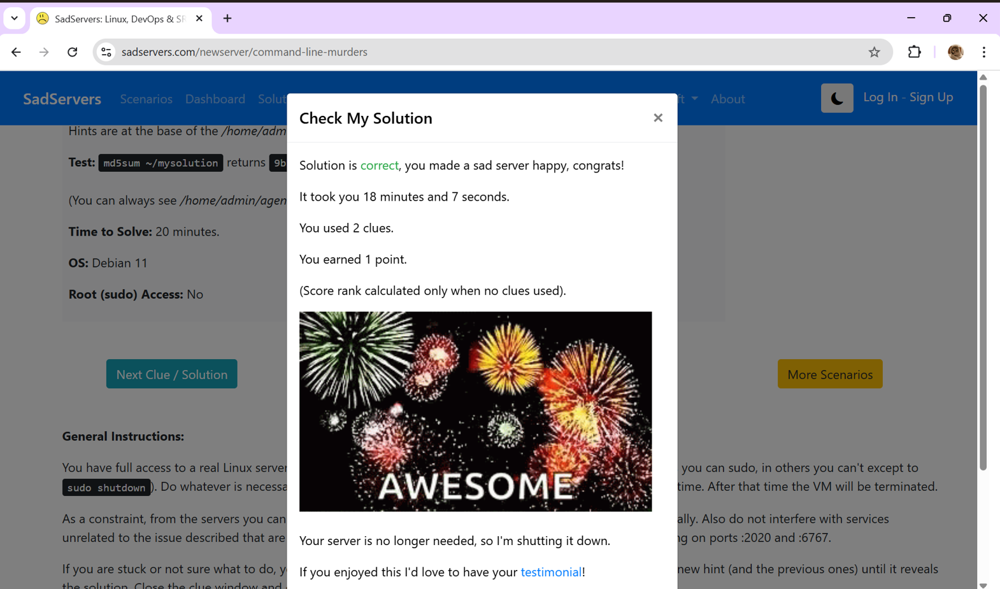

---

# **Task 20: Notebook Ninja – Getting Started with Jupyter**

## Overview
This task helped me to get familiarized with Jupyter Notebook as a tool for coding, documentation and presentation. The goal was to create a clean, well-structured notebook combining markdown, python, and visualiztion.

## Objectives
1. Learnt to structure a notebook using markdwon  
2. Practiced simple python coding data visualization  
3. Documented the processes clearly for better communication and pushed the same into my github repo

## Working
I useed simple commands to add titles, section headers, bulletins, formatting text, embedding an image, include code snippet, perform simple calculations and plot a simple graph using Matplotlib.

[Ninja notebook](https://github.com/shriyabhat101207-ai/ninjanotebook/blob/main/ninjanotebook.ipynb)

---

# **Task 21: Watch & Reflect – Intro to Machine Learning**

## Overview

Understood foundational ML concepts and data preparation techniques by watching two beginner-friendly videos and writing an article about the same 

[Article](https://github.com/shriyabhat101207-ai/summary/blob/main/summary.md)


